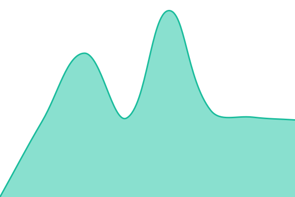
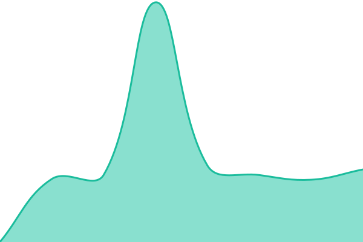

# [📈 实时状态](https://status.mcfywb.top): <!--live status--> **所有系统均运行正常**

This repository contains the open-source uptime monitor and status page for [MC 风月无边](https://mcfywb.top), powered by [Upptime](https://github.com/upptime/upptime).

With [Upptime](https://upptime.js.org), you can get your own unlimited and free uptime monitor and status page, powered entirely by a GitHub repository. We use [Issues](https://github.com/MCfywb/upptime/issues) as incident reports, [Actions](https://github.com/MCfywb/upptime/actions) as uptime monitors, and [Pages](https://status.mcfywb.top) for the status page.

## [📈 Live Status](https://demo.upptime.js.org): <!--live status--> **所有系统均运行正常**

<!--start: status pages-->
<!-- This summary is generated by Upptime (https://github.com/upptime/upptime) -->
<!-- Do not edit this manually, your changes will be overwritten -->
<!-- prettier-ignore -->
| URL | Status | History | Response Time | Uptime |
| --- | ------ | ------- | ------------- | ------ |
|  [blog(main)](https://mcfywb.top) | 已启动 | [blog-main.yml](https://github.com/MCfywb/upptime/commits/HEAD/history/blog-main.yml) | 

 1538毫秒
     
 | 

<a href="https://status.mcfywb.top/history/blog-main">100.00%</a>
    

|  [blog(github)](https://mcfywb.github.io) | 已启动 | [blog-github.yml](https://github.com/MCfywb/upptime/commits/HEAD/history/blog-github.yml) | 

 162毫秒
     
 | 

<a href="https://status.mcfywb.top/history/blog-github">100.00%</a>
    

|  [twikoo](https://twikoo.mcfywb.top) | 已启动 | [twikoo.yml](https://github.com/MCfywb/upptime/commits/HEAD/history/twikoo.yml) | 

 1342毫秒
     
 | 

<a href="https://status.mcfywb.top/history/twikoo">100.00%</a>
    

|  [storge](https://file.mcfywb.top) | 已启动 | [storge.yml](https://github.com/MCfywb/upptime/commits/HEAD/history/storge.yml) | 

 1604毫秒
     
 | 

<a href="https://status.mcfywb.top/history/storge">100.00%</a>
    

|  [orange-generator](https://orange.mcfywb.top) | 已启动 | [orange-generator.yml](https://github.com/MCfywb/upptime/commits/HEAD/history/orange-generator.yml) | 

 1046毫秒
     
 | 

<a href="https://status.mcfywb.top/history/orange-generator">100.00%</a>
    

|  [image](https://img.mcfywb.top) | 已启动 | [image.yml](https://github.com/MCfywb/upptime/commits/HEAD/history/image.yml) | 

 1540毫秒
     
 | 

<a href="https://status.mcfywb.top/history/image">100.00%</a>
    

|  [cdn](https://cdn.mcfywb.top) | 已启动 | [cdn.yml](https://github.com/MCfywb/upptime/commits/HEAD/history/cdn.yml) | 

 1525毫秒
     
 | 

<a href="https://status.mcfywb.top/history/cdn">100.00%</a>
    

|  [meting-api](https://meting.mcfywb.top/demo) | 已启动 | [meting-api.yml](https://github.com/MCfywb/upptime/commits/HEAD/history/meting-api.yml) | 

 803毫秒
     
 | 

<a href="https://status.mcfywb.top/history/meting-api">91.30%</a>
    

|  [img2color](https://color.mcfywb.top/api) | 已启动 | [img2color.yml](https://github.com/MCfywb/upptime/commits/HEAD/history/img2color.yml) | 

 898毫秒
     
 | 

<a href="https://status.mcfywb.top/history/img2color">100.00%</a>
    

<!--end: status pages-->

[**Visit our status website →**](https://status.mcfywb.top)

## 📄 License

- Powered by: [Upptime](https://github.com/upptime/upptime)
- Code: [MIT](./LICENSE) © [Anand Chowdhary](https://anandchowdhary.com)
- Data in the `./history` directory: [Open Database License](https://opendatacommons.org/licenses/odbl/1-0/)
